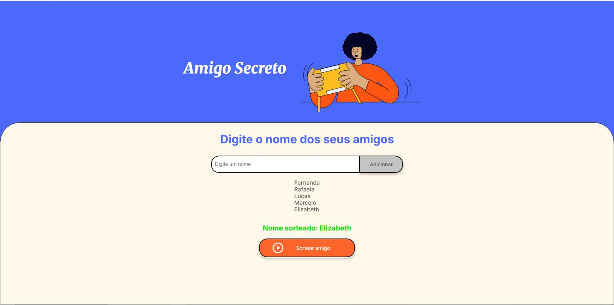

<h1 align="center">🎁 Projeto Amigo Secreto</h1>

<h2>📖 Sobre</h2>

  Este projeto faz parte do programa <strong>ONE (Oracle Next Education)</strong> e foi desenvolvido com base na metodologia <strong>Challenge-Based Learning</strong>, uma abordagem de aprendizagem baseada em desafios criada pela <a href="https://www.apple.com">Apple</a>.

  O <strong>Desafio Amigo Secreto</strong> é um passo importante para o sucesso na formação, promovendo o uso prático da <strong>lógica de programação</strong> por meio de um exercício divertido e interativo.

  Através desse desafio, é possível:
  <ul>
    <li>Consolidar conhecimentos de programação</li>
    <li>Dominar o pensamento lógico</li>
    <li>Aprimorar habilidades de análise e resolução de problemas</li>
    <li>Ampliar a perspectiva no mundo do desenvolvimento</li>
  </ul>

  <strong>Mãos na massa!</strong> 💻🚀

---

<h2>🚀 Tecnologias utilizadas</h2>

  
  
  

---

<h2>🎮 Como usar</h2>

<ol>
  <li>Clone este repositório:</li>

  <pre><code>git clone https://github.com/seu-usuario/amigo-secreto.git</code></pre>

  <li>Abra o arquivo <code>index.html</code> em seu navegador.</li>
  <li>Digite os nomes dos participantes e clique em <strong>Adicionar</strong>.</li>
  <li>Depois clique em <strong>Sortear amigo</strong> para ver o resultado.</li>
</ol>

---

<h2>📁 Estrutura do Projeto</h2>

<pre><code>.
├── index.html        # Estrutura da página
├── style.css         # Estilo visual moderno e responsivo
├── app.js            # Lógica do sorteio e interação
└── assets/           # Imagens e ícones utilizados
</code></pre>

---

<h2>✨ Funcionalidades</h2>

<ul>
  <li>Adição de nomes com validação (sem números e sem vazios)</li>
  <li>Lista dinâmica exibida em tempo real</li>
  <li>Sorteio aleatório de um amigo da lista</li>
  <li>Feedback visual com resultado exibido</li>
</ul>

---

<h2>📸 Captura de tela</h2>

---

<h2>👩‍💻 Desenvolvedora</h2>

<ul>
  <li><strong>Nome:</strong> Nanda</li>
  <li><strong>GitHub:</strong> <a href="https://github.com/seu-usuario">@fernandapaoleschi</a></li>
</ul>

---

<h2>📝 Licença</h2>

Este projeto está sob a licença <strong>MIT</strong>. Fique à vontade para usar, modificar e compartilhar!

---

⭐ Se você gostou, deixe uma estrela no repositório!

